####集成指南

<small>
注：本文为Mac桌面SDK的新手使用教程，只涉及集成SDK的方法，默认读者已经熟悉Xcode开发工具的基本使用方法，以及具有一定的编程知识基础等。
</small>

<b><small>1.App认证</small></b>

<small>
使用SDK前请先登录 [云视讯管理平台](https://vip.xylink.com) 注册App（管理平台-云视讯API），将需要集成SDK的App的Bundle ID添加到该项中，SDK会验证App的Bundle ID，未经认证的App无法使用SDK的各项功能。
</small>

<b><small>2.下载SDK</small></b>

<small>注意：公有云和私有云目前使用同一套SDK。（XYLinkSDK.framework包大小约为28M，嵌入后app安装包增加约13M）[版本下载](http://openapi.xylink.com/mac/#_3)</small>

<small>

|  SDK版本  |  公有云  |  私有云  |
| :-----: | ----- | ----- |
| 2.24.0.1-20190408 | 支持 | v3.6+ |

</small>

<b><small>3.搭建开发环境</small></b> 

<small>(1)导入XYLinkSDK.framework。</small>

<small>如下图:</small> 

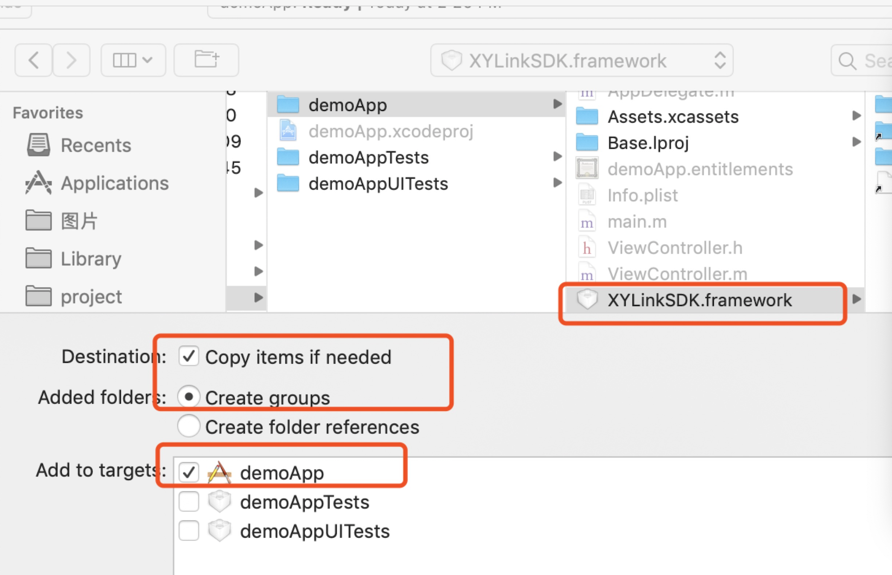

<small>(2)在Xcode的Build Phases页面中，将XYLinkSDK.framework添加到Link Binary With Libraries，并将XYLinkSDK.framework添加到Embed Frameworks。
</small>

<small>如下图:</small>

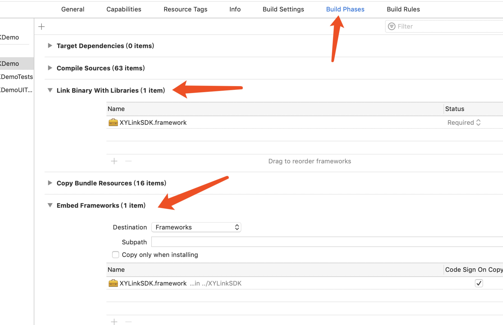

<b><small>4.注意事项</small></b>    

<small>4.1 SDK支持的系统最低版本为macOS 10.10</small>    

<small>4.2 权限申请，使用SDK需申请摄像头和麦克风权限。</small>

<small>如下图:</small>

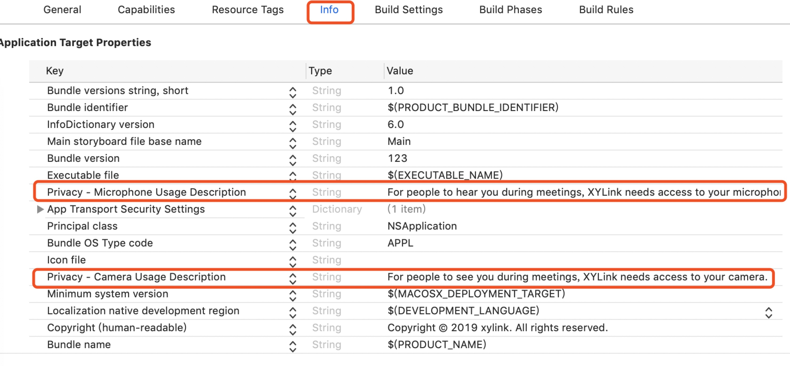

<small>4.3 App Sandbox 必须关闭，否则请求发不出去。</small>

<small>如下图:</small>

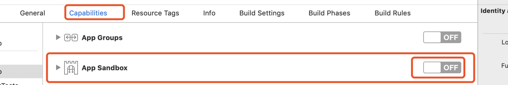

<small>4.4 本地化语言，通话接口相关的错误提示文字如需定制，请在XYLinkSDKLocation.string中添加。</small>  

#### 接口说明

<small>该项列举了使用SDK的主要接口</small>

<b><small>1.获取XYLinkSDK单例</small></b> 

<small>

```
/**
 *  获取XYLinkSDK单例
 *
 *  @return XYLinkSDK SDK单例对象
 */
+ (XYLinkSDK *)sharedXYLinkSDK;

```
</small>

<b><small>2.初始化</small></b> 

<small>

```
/**
 *  初始化XYLinkSDK环境
 *
 *  @param settings 初始化参数
 *  @param aBlock  初始化完成block
 */
- (void)initWithSettings:(XYSettings *)settings block:(sdkCommonFunctionBlock)aBlock;

typedef void (^sdkCommonFunctionBlock)(id obj);

@interface XYSettings : NSObject
@property (nonatomic, copy) NSString        *extId;     // 企业ID（必填项，为nil时sdk内部会抛出异常）
@property (nonatomic, copy) NSString        *server;    // server地址，为nil时使用cloud.xylink.com
@property (nonatomic, assign) XYLogLevel    level;      // log等级
@property (nonatomic, assign) BOOL          enableLog;  // 是否打印log
+ (XYSettings *)sharedXYSettings;
@end

```
</small>

<b><small>3.设置delegate</small></b> 

<small>

```
/**
 *  实现代理方法用于接收回调的状态
 */
@property (nonatomic, weak) id<XYLinkSDKDelegate> delegate;

```

</small>

<b><small>4.登录</small></b> 

<small>

```
/**
 *  使用第三方用户标识登录
 *
 *  @param extUserId 第三方用户ID，需保证唯一性，建议使用自己业务系统的userId
 *  @param userName 第三方用户名，用于在会议中显示的用户名
 *  @param result 登录结果block，其中第一个BOOL表示登录是否成功，第二个BOOL表示是否需要网络探测，XYUser是账号信息，登录成功时XYUser.error为nil,登录失败时XYUser.error代表具体的错误信息
 */
- (void)loginExternalAccount:(NSString *)extUserId
                    userName:(NSString *)userName
                      result:(loginResultBlock)result;

typedef void (^loginResultBlock)(XYUser *, BOOL,BOOL);
// 用户个人信息
@interface XYUser : NSObject
@property (nonatomic, copy) NSString                    *callNumber;        // 号码
@property (nonatomic, copy) NSString                    *deviceDisplayName; // 用户名
@property (nonatomic, copy) NSString                    *deviceUri;
@property (nonatomic, copy) NSString                    *error;             // 错误描述
@property (nonatomic, assign) long                      userId;             // 用户ID
@property (nonatomic, assign) long                      deviceId;           // 设备ID
@property (nonatomic, assign) XYLinkSDKRemoteDataType   deviceType;         // 设备类型
@end

```
</small>

<b><small>5.呼叫</small></b> 

<small>

```
/**
 *  呼叫
 *
 *  @param number      会议号或终端号，不可为空
 *  @param mode        呼叫类型
 *  备注：请在收到回调xyLinkSDKOnNetworkDetectionFinished后再做呼叫操作。
 */
- (void)makeCall:(NSString *)number
        callMode:(XYLinkSDKCallMode)mode;

//呼叫模式
typedef enum
{
    XYLinkSDKCallMode_AudioVideo, // 音视频入会
    XYLinkSDKCallMode_ContentOnly // 共享桌面入会
} XYLinkSDKCallMode;

```
</small>

<b><small>6.验证入会密码</small></b> 

<small>

```
/**
 *  验证入会密码
 *
 *  @param passwordStr 密码
 *  注意：对于有入会密码的会议，需要验证密码。请根据呼叫的回调接口xyLinkSDKOnCallStateChange的callState来决定是否需要调用此接口
 */
- (void)validatePassword:(NSString *)passwordStr;

```
</small>

<b><small>7.回调方法</small></b> 

<small>1）连接状态的回调</small>

<small>

```
/**
 *  登录后与小鱼的连接状态
 *
 *  @param isConnect  是否连接
 */
- (void)xyLinkSDKOnConnectStateChanged:(BOOL)isConnect;

```
</small>

<small>2）网络探测结束回调</small>

<small>

```
/**
 *  网络探测结束回调
 *
 *  @param user 登录的用户信息
 *  注意：登录后SDK会自动进行网络探测，App在收到这个回调后才可以发起呼叫
 */
- (void)xyLinkSDKOnNetworkDetectionFinished:(XYUser *)user;

```
</small>

<small>3）呼叫建立前发生异常的回调</small>

<small>

```
/**
 *  呼叫建立前发生异常的回调
 *
 *  @param number    号码
 *  @param reason    异常状态原因
 */
- (void)xyLinkSDKOnCallFailed:(NSString *)number withReason:(NSString *)reason;

NSString *const XYCallFailedReason_AlreadyInCall = @"ALREADY_IN_CALL";          // 已经发起呼叫
NSString *const XYCallFailedReason_ServerDisconnected = @"SERVER_DISCONNECTED"; // 服务未连接
NSString *const XYCallFailedReason_InvalidSession = @"INVALID_SESSION";         // 无效呼叫
NSString *const XYCallFailedReason_NotLogin = @"NOT_LOGGED_IN";                 // 未登录
NSString *const XYCallFailedReason_InvliadCallNumber = @"INVLIAD_CALL_NUMBER";  // 呼叫号码非法

```
</small>

<small>4）呼叫状态的回调</small>

<small>

```
/**
 *  呼叫状态的回调
 *
 *  @param remoteName    呼叫的名称
 *  @param callState 呼叫状态
 *  @param reason    异常状态原因
 */
- (void)xyLinkSDKOnCallStateChange:(NSString *)remoteName
                             state:(XYLinkCallState)callState
                            reason:(NSString *)reason;
                            
                            //呼叫状态
typedef enum
{
    XYLinkSDKCallState_Connected = 0,   // 已连接
    XYLinkSDKCallState_DisConnected,    // 未连接
    XYLinkSDKCallState_VarifyPassword,  // 验证密码
    XYLinkSDKCallState_PasswordError,   // 密码错误
    XYLinkSDKCallState_Connecting       // 正在连接
} XYLinkCallState;
```
</small>

<small>5）通话视频信息流改变回调</small>

<small>

```
/**
 *  通话视频信息流改变回调
 *
 *  @param videos 当前通话中与会者的视频信息流数组(包含streamID和其他stream信息)
 */
- (void)xyLinkSDKOnVideoStreamChanged:(NSArray *)videos;

// 视频流信息
@interface XYLinkSDKLayoutInfo : NSObject
@property (nonatomic, copy) NSString                    *streamID;          // 视频流ID
@property (nonatomic, copy) NSString                    *remoteUri;         // 远端uri
@property (nonatomic, copy) NSString                    *remoteName;        // 远端名称

@property (nonatomic, assign) int                       participantId;      // 与会者ID
@property (nonatomic, assign) long                      remoteID;           // 远端ID
@property (nonatomic, assign) BOOL                      isContent;          // 是否是content
@property (nonatomic, assign) BOOL                      isAudioMute;        // 是否关闭音频
@property (nonatomic, assign) BOOL                      isActiveSpeaker;    // 是否发言
@property (nonatomic, assign) XYLinkSDKVideoState       layoutState;        // 视频状态
@property (nonatomic, assign) XYLinkSDKVideoMuteReason  videoMuteReason;    // 视频关闭原因
@property (nonatomic, assign) XYLinkSDKRemoteDataType   remoteType;         // 远端类型
@end

```
</small>

<small>6）Roster发生改变的回调</small>

<small>

```
/**
 *  Roster发生改变的回调
 *
 *  @param rosters   与会者信息
 */
- (void)xyLinkSDKOnRosterChanged:(XYSDKRosterInfo *)rosters;

//roster(单个与会者信息)
@interface XYSDKRosterElement : NSObject
@property (nonatomic, copy) NSString    *deviceId;
@property (nonatomic, copy) NSString    *deviceName;
@property (nonatomic, copy) NSString    *deviceAlias;           // 设备别名

@property (nonatomic, assign) int       pid;                    // 参会人ID
@property (nonatomic, assign) BOOL      isTelephone;            // 是否是电话
@property (nonatomic, assign) BOOL      isObserver;
@property (nonatomic, assign) BOOL      isAudioOnly;            // 是否只有语音
@property (nonatomic, assign) BOOL      isAudioMute;            // 是否静音
@property (nonatomic, assign) BOOL      isVideoMute;            // 是否关闭视频
@property (nonatomic, assign) BOOL      isForceFullScreen;      // 是否被force到大屏
@property (nonatomic, assign) BOOL      isRequested;

@property (nonatomic, assign) XYLinkSDKRemoteDataType   deviceType;
@property (nonatomic, assign) XYLinkSDKVideoMuteReason  videoMuteReason;
@end

//roster(所有与会者信息)
@interface XYSDKRosterInfo : NSObject
@property (nonatomic, assign) int participantsNum;  // 与会者人数
@property (nonatomic, assign) int activeSpeakerPid;
@property (nonatomic, assign) int contentSenderPid;
@property (nonatomic, strong) NSArray<XYSDKRosterElement *>  *elements;
@end

```
</small>

<small>7）会控消息的回调</small>

<small>

```
/**
 *  会控消息的回调
 *
 *  @param confInfo 会控消息
 */
- (void)xyLinkSDKOnConfMgmtStateChanged:(SDKConfMsgInfo *)confInfo;


//会控消息模型
@interface SDKConfMsgInfo : NSObject
@property (nonatomic, assign) BOOL isChairmanMode;      // 主会场模式
@property (nonatomic, assign) BOOL muteIsDisabled;      // 会控是否强制静音
@property (nonatomic, assign) BOOL contentIsDisabled;   // 桌面共享是否禁用
@property (nonatomic, copy) NSString *operationStr;     // 操作
@property (nonatomic, copy) NSString *chairmanUri;      // 主会场的url
@end

```
</small>

<small>8）双流状态改变回调</small>

<small>

```
/**
 *  双流状态改变回调
 *
 *  @param state 双流状态
 */
- (void)xyLinkSDKOnDualStreamStateChanged:(XYLinlSDKDualStreamState)state;

```
</small>

<small>9）来电的回调</small>

<small>

```
/**
 *  来电的回调
 *
 *  @param number         号码
 *  @param displayName    名称
 */
- (void)xyLinkSDKOnReceivedCall:(NSString *)number displayName:(NSString *)displayName;

```
</small>

<small>10）设备插拔回调</small>

<small>

```
/**
 *  设备插拔回调
 *
 *  @param mediaType 被插拔的媒体类型
 *  备注： app在收到这个回调时，可以调用XYLinkDemo.getDeviceList获取最新的设备列表，然后通过XYLinkDemo.chooseDevice设置自己选择的设备。
 */
- (void)xyLinkSDKOnDeviceListChange:(XYLinkSDKMediaType)mediaType;

```
</small>

<small>11）异地登录回调</small>

<small>

```
/**
 *  同一个账号在其他设备登录时，该账号在之前的设备会被强制下线
 */
- (void)xyLinkSDKOnAccountKickedOut;

```
</small>

<b><small>其他接口</small></b> 

<small>1）退出登录</small>

<small>

```
/**
 *  退出登录
 *
 *  @param block 退出登录结果block，true为退出成功，false为退出失败
 */
- (void)logout:(loginOutBlock)block;
typedef void (^loginOutBlock)(BOOL success);


```
</small>

<small>2）接听</small>

<small>

```
/**
 *  接听
 */
- (void)acceptCall;

```
</small>

<small>3）挂断</small>

<small>

```
/**
 *  挂断
 */
- (void)hangup;

```
</small>

<small>4）自定义布局</small>

<small>

```
/**
 *  customLayout 自定义布局
 *
 *  @param info 布局信息 bForceRequest 是否强制刷新
 */
- (void)customLayout:(XYLinkSDKCustomLayoutInfo *)info forceRequest:(BOOL)bForceRequest;


// 自定义布局元素信息 【自定义布局】
@interface XYLinkSDKCustomLayoutElement : NSObject
@property (nonatomic, assign) int participantId;
@property (nonatomic, assign) int width;
@property (nonatomic, assign) int height;
@property (nonatomic, assign) XYLinkSDKVideoQuality quality;
@property (nonatomic, assign) XYLinkSDKLayoutPriority priority;
@end

// 自定义布局信息 【自定义布局】
@interface XYLinkSDKCustomLayoutInfo : NSObject
@property (nonatomic, assign) XYLinkSDKLayoutMode layoutMode;
@property (nonatomic, strong) NSArray<XYLinkSDKCustomLayoutInfo *>  *layoutElements;
@end

```
</small>

<small>
备注：请使用customLayout设置自己需要的布局信息，然后在回调xyLinkSDKOnVideoStreamChanged中拿到最新的视频流信息，刷新布局即可。
</small>

<small>5）开始桌面共享</small>

<small>

```
/**
 *  开始桌面共享
 */
- (void)startContentSharing;

```
</small>

<small>6）停止桌面共享</small>

<small>

```
/**
 *  停止桌面共享
 */
- (void)stopContentSharing;

```
</small>

<small>7）举手发言</small>

<small>

```
/**
 *  举手发言
 */
- (void)handsUp;

```
</small>

<small>8）取消发言</small>

<small>

```
/**
 *  取消发言
 */
- (void)cancelHandsUp;

```
</small>

<small>9）发言完毕</small>

<small>

```
/**
 *  发言完毕
 */
- (void)handsUpEnd;

```
</small>

<small>10）麦克风是否静音</small>

<small>

```
/**
 *  麦克风是否静音
 *
 *  @return  麦克风是否静音
 */
- (BOOL)micIsMuted;
```
</small>

<small>11）切换麦克风状态</small>

<small>

```

/**
 *  切换麦克风状态
 *
 *  @param notifyRemote 是否通知远端
 *  注意：切换麦克风状态，SDK内部会根据麦克风的当前状态自动关闭或者打开麦克风
 */
- (void)changeMicState:(BOOL)notifyRemote;

```
</small>

<small>12）摄像头是否开启</small>

<small>

```
/**
 *  摄像头是否开启
 * 
 *  @return BOOL  true 摄像头已开启
 */
- (BOOL)videoIsMuted;

```
</small>

<small>13）开启或关闭摄像头</small>

<small>

```
/**
 *  开启或关闭摄像头
 * 
 *  @param enable   false表示关闭摄像头，true表示打开摄像头
 */
- (void)enableVideo:(BOOL)enable;

```
</small>

<small>14）扬声器状态</small>

<small>

```
/**
 *  扬声器状态
 *
 *  @return true表示扬声器已静音
 */
- (BOOL)speakerIsMuted;

```
</small>

<small>15）扬声器音量</small>

<small>

```
/**
 *  扬声器音量
 *
 *  @return 音量值，值为0～1的浮点数
 */
- (float)speakerVolume;

```
</small>

<small>16）关闭或者打开扬声器</small>

<small>

```
/**
 *  关闭或者打开扬声器
 *
 *  @param mute true表示关闭
 */
- (void)enableSpeaker:(BOOL)mute;

```
</small>

<small>17）设置扬声器音量</small>

<small>

```
/**
 *  设置扬声器音量
 *
 *  @param volume 音量值，为0～1的浮点数
 */
- (void)setSpeakerVolume:(float)volume;

```
</small>

<small>18）音视频设备选择相关</small>

<small>

```
/**
 *  获取频设备列表
 *
 *  @param mediaType 媒体类型
 *  @return array 设备列表数组，数组的元素是XYLinkSDKDevice类型
 */
- (NSArray *)getDeviceList:(XYLinkSDKMediaType)mediaType;

/**
 *  设置选择的音视频设备
 *
 *  @param deviceInfo 设备信息
 *  @param mediaType 媒体类型
 */
- (void) chooseDevice:(XYLinkSDKDevice *)deviceInfo
           mediaType:(XYLinkSDKMediaType)mediaType
               block:(sdkSelectDeviceBlock)completeBlock;
 
/**
 *  获取当前使用的设备
 *
 * @param mediaType 媒体类型
 * @param input 视频传false，音频输入传true，音频输出传false
 * @return 当前使用的设备
 */
- (XYLinkSDKDevice *)getCurrentUsedDevice:(XYLinkSDKMediaType)mediaType bInput:(BOOL)input;


/**
 *  获取系统默认使用的设备
 *
 * @param mediaType 媒体类型
 * @param input 视频传false，音频输入传true，音频输出传false
 * @return 系统默认使用的设备
 */
- (XYLinkSDKDevice *)getSystemDefaultUsedDevice:(XYLinkSDKMediaType)mediaType bInput:(BOOL)input;

```
</small>

<small>19）是否需要开启音视频的权限</small>

<small>

```
/**
 *  是否需要开启音视频的权限
 *
 *  @param mediaType 媒体类型
 *  @BOOL  true需要权限，false不需要权限
 */
- (BOOL)needOpenAuthorization:(XYLinkSDKMediaType)mediaType;

```
</small>

<small>20）修改服务器地址相关</small>

<small>

```
/**
 *  修改服务器地址
 *
 *  @param address 服务器域名
 *  @param httpPort http请求端口号
 *  @param httpsPort https请求端口号
 */
- (void)modifyServerAddress:(NSString *)address
                   httpPort:(NSString *)httpPort
                  httpsPort:(NSString *)httpsPort;


/**
 *  获取当前服务器地址
 *
 *  @return 当前服务器地址
 *  注意已分割为： 服务器域名，http请求端口号， https请求端口号
 */
- (NSArray *)currentServerAddress;


/**
 *  获取默认服务器地址
 *
 *  @return 默认服务器地址
 *  注意已分割为： 服务器域名，http请求端口号， https请求端口号
 */
- (NSArray *)defaultServerAddress;
```
</small>

<small>21）获取统计信息</small>

<small>

```
/**
 *  获取统计信息（用户版）
 *  
 *  @return NSString 统计信息
 */
- (NSString *)getGeneralStatistics;

```
</small>

<small>22）上传日志</small>

<small>

```
/**
 *  上传日志
 *  
 *  @param title 日志标题
 */
- (void)feedback:(NSString *)title;

```
</small>

<small>23）统计信息（开发版）</small>

<small>

```
/**
 *  视频发送信息（开发版）
 *
 *  @return NSString 统计信息
 */
- (NSString *)getVideoTxStatistics;

/**
 *  视频接收信息(开发版)
 *
 *  @return NSString 统计信息
 */
- (NSString *)getVideoRxStatistics;

/**
 *  音频发送信息（开发版）
 *
 *  @return NSString 统计信息
 */
- (NSString *)getAudioTxStatistics;

/**
 *  音频接收信息（开发版）
 *
 *  @return NSString 统计信息
 */
- (NSString *)getAudioRxStatistics;

/**
 *  其他信息（开发版）
 *
 *  @return NSString 统计信息
 */
- (NSString *)getOtherStatistics;

/**
 *  基本统计信息（开发版）
 *
 *  @return SDKGeneralStatistics 基本统计信息
 */
- (SDKGeneralStatistics *)getStatistics;

/**
 *  获取音视频信息的过滤标记（开发版）
 *
 *  @param keyStr  过滤标记对应的key值
 *  @return  过滤标记
 */
- (uint32_t)getDumpFlagValue:(NSString *)keyStr;

/**
 *  获取音视频信息的过滤条件字典（开发版）
 *
 *  @return  过滤条件字典
 */
- (NSDictionary *)getDumpStateDic;

/**
 *  设音视频信息的过滤条件字典（开发版）
 *
 *  @param  stateDic 过滤条件字典
 */
- (void)setDumpStateDic:(NSDictionary *)stateDic;

/**
 *  设音视频信息的过滤标记（开发版）
 *
 *  @param  dumpMask 过滤标记
 */
- (void)setMediaDumpMask:(uint32_t)dumpMask;

/**
 *  保存dump信息
 */
- (void)saveDump;

```

</small>

<small>24）通话中的会议相关信息</small>

<small>

```
/**
 *  通话中的会议号
 */
- (NSString *)currentMeetingNumber;

/**
 *  通话中的会议室名称
 */
- (NSString *)currentMeetingName;

```
</small>

<b><small>其他回调</small></b> 

<small>1）会控录制状态回调</small>

<small>

```
/**
 *  会控录制状态回调
 *
 *  @param bStart 是否已经开始录制
 */
- (void)xyLinkSDKOnRecordStatusChanged:(BOOL)bStart;

```
</small>

<small>2) 与会者被暂时隔离在会议之外</small>

<small>

```
/**
 *  与会者被暂时隔离在会议之外
 *
 *  @param bHold ture表示被hold
 */
- (void)xyLinkSDKOnHoldMediaStatusChangedByConfMgmt:(BOOL)bHold;

```
</small>

<small>3) 会控取消举手发言</small>

<small>

```
/**
 *  会控取消举手发言
 */
- (void)xyLinkSDKOnCancelHandsUpByConfMgmt;

```
</small>

<small>4) 网络状态等级变化回调</small>

<small>

```
/**  网络状态等级变化回调
 *
 *  @param level 网络状态等级（共分为4个等级-> 1 2 3 4，由低到高分别为差，中，良，优）
 */
- (void)xyLinkSDKOnNetworkIndicatorLevelChanged:(int)level;

```
</small>

<small>5) 服务器地址改变回调</small>

<small>

```
/**
 *  服务器地址改变回调
 *
 *  @param restServer 服务器域名
 *  @param httpPort http请求端口号
 *  @param httpsPort https请求端口号
 */
- (void)xyLinkSDKOnServerAddressChanged:(NSString *)restServer
                               httpPort:(NSString *)httpPort
                              httpsPort:(NSString *)httpsPort;

```
</small>

<small>6) 上传反馈信息完成</small>

<small>

```
/**
 *  上传反馈信息完成
 *
 * @param success true表示上传成功
 */
- (void)xyLinkSDKOnSendFeedback:(BOOL)success;

```
</small>

#### FAQ
<b><small>1.Framework搜索路径错误</small></b> 

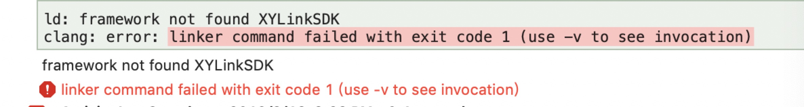

<small><b>解决办法：</b>提示这种错误的时候需要检查Framework的搜索路径是否设置或是否正确。建议按照集成指南的搭建开发环境第一步导入XYLinkSDK.framework，这样会自动生成正确的framework搜索路径。</small>

<b><small>2.Header搜索路径错误 </small></b> 

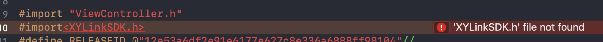

<small><b>解决办法：</b>提示这种错误需要检查Header搜索路径是否设置或是否正确；</br>
若Header搜索路径直接指向"XYLinkSDK.framework/Headers"，引入头文件时只需

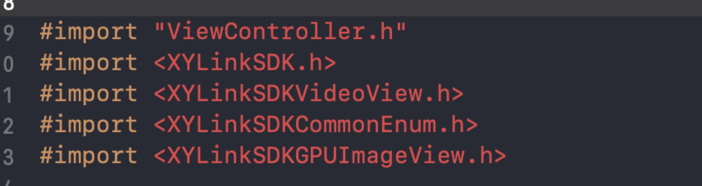

若Header搜索路径直接指向"XYLinkSDK.framework"，引入头文件时需要
 


</small>

<b><small>3.image not found</small></b> 

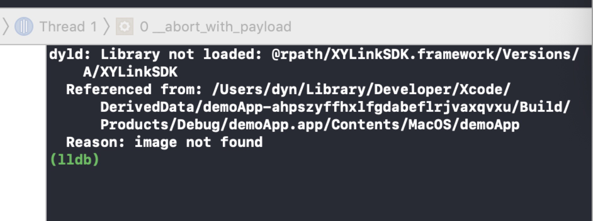

<small><b>解决办法：</b>出现这个错误时检查下对应target下General -> Embedded Binaries中是否有XYLinkSDK.framework

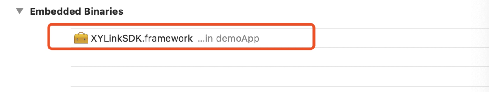

没有的话加上，然后把Link Binary With Libraries中重复的framework文件删掉。</small>

<b><small>4.image not found-libsSwiftCore.dylib</small></b> 

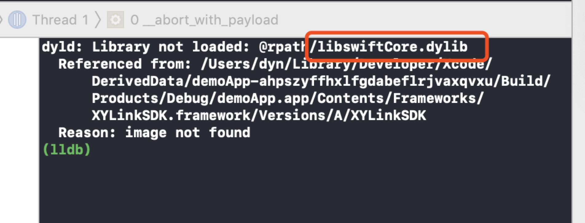

<small><b>解决办法：</b>设置Always Embed Swift Standard Libraries 为YES。</small>

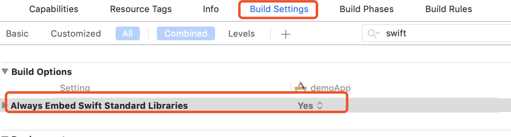


<b><small>4.log</small></b> 

<small>log文件路径:~/Library/Application\ Support/Bundle ID 。比如当前App的Bundle ID为 com.xylink.macSDK ，则log位置为：~/Library/Application\ Support/com.xylink.macSDK</small>

<b><small>5.服务器返回Code值</small></b>

<small><b> 参考文件：</b>[呼叫断开原因说明](http://openapi.xylink.com/a/#_7)</small>

